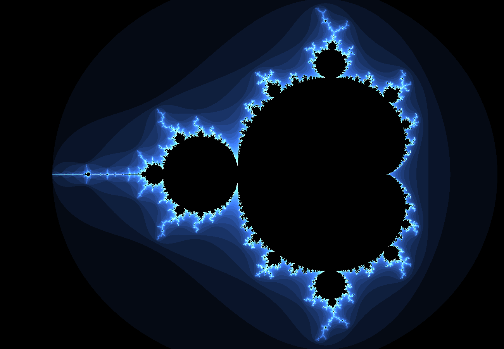
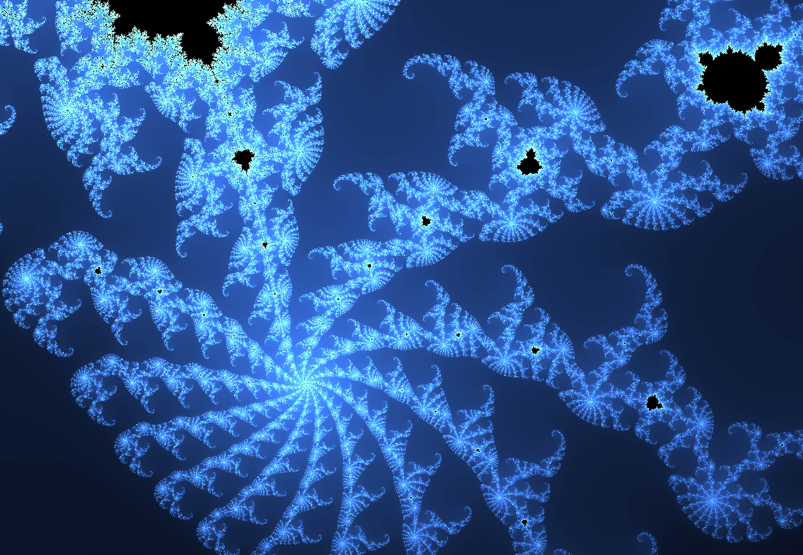
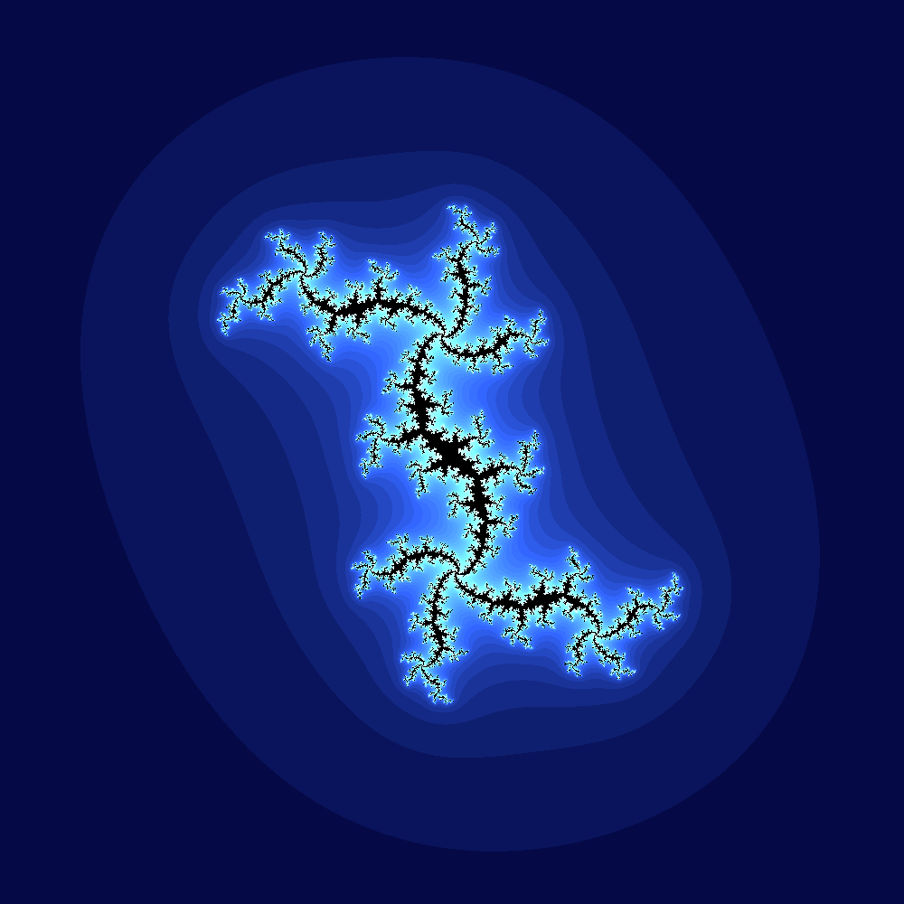
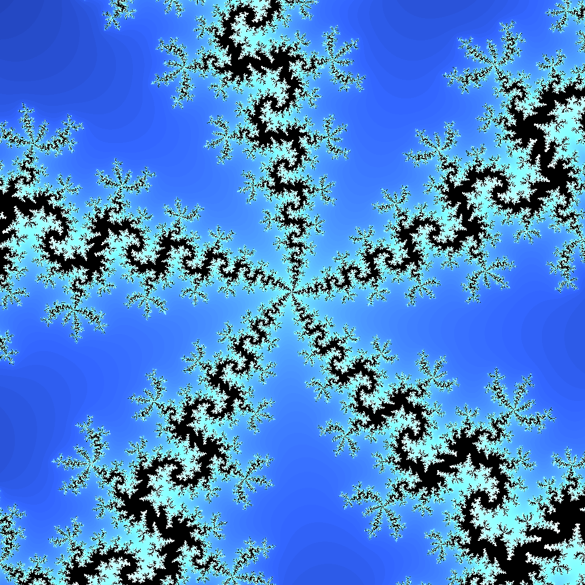

# Mandelbrot Set Explorer
The Mandelbrot set is described as the set of numbers $$c$$ on the complex plane where the function 
$$f_c(z) = z^2 + c$$ does not ever diverge when iterated starting at $$z = 0$$.
This project visualises the set by calculating how many iterations of the formula it takes for the complex number z to have a modulus greater than 2 and then assigning a colour to that pixel based on how many iterations it took to diverge. If the complex number does not diverge after a set number of maximum iterations, the pixel is set to black.

 

Due to floating point errors, the resolution of the calculated image significantly reduces at zoom levels below 0.00001.
This could be remedied by using double precision in the shaders, or to have custom floating point number representation which may significantly slow down rendering time. This may be revisited at some point in the future.

To explore the set, hold down left click and drag the cursor across the screen and use the scrollwheel input to zoom in or out.

[ImGui](https://github.com/ocornut/imgui) is used to display some information and settings for the project.
Information such as the position of the mouse on the complex plane, zoom 
A grid can be toggled on or off to help find the location of a point on the complex plane.

## Julia Set
A second set called the Julia set can also be rendered alongside the Mandelbrot set by ticking the relevant checkbox.
The Julia set is very similar to the Mandelbrot Set, it follows the same rules for rendering
however in the function $$f(z) = z^2 + c$$, $$c$$ is constant for all pixels and the starting value of $$z$$ is the complex position of the pixel.

The value of c is determined by the position of an adjustable marker on the Mandelbrot set which can be moved around by clicking and dragging, or by holding down right click.
The position can also be set in an ImGui window that appears.

 

## Dependencies
- GLFW
- GLEW
- [ImGui](https://github.com/ocornut/imgui)
- [maths](https://github.com/Fizzchimp/maths)
